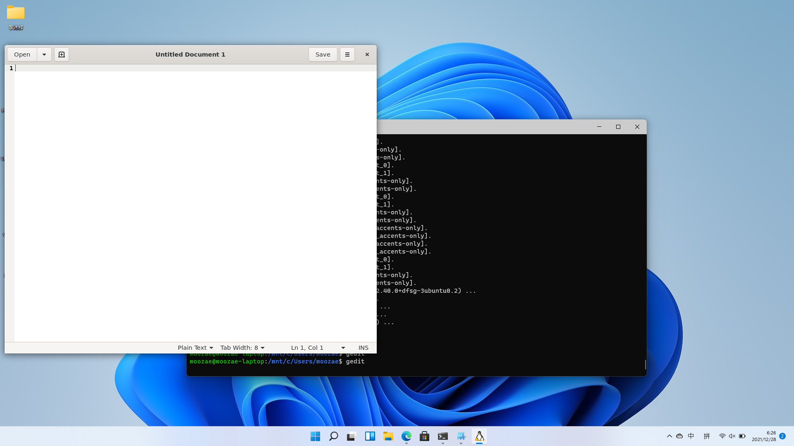
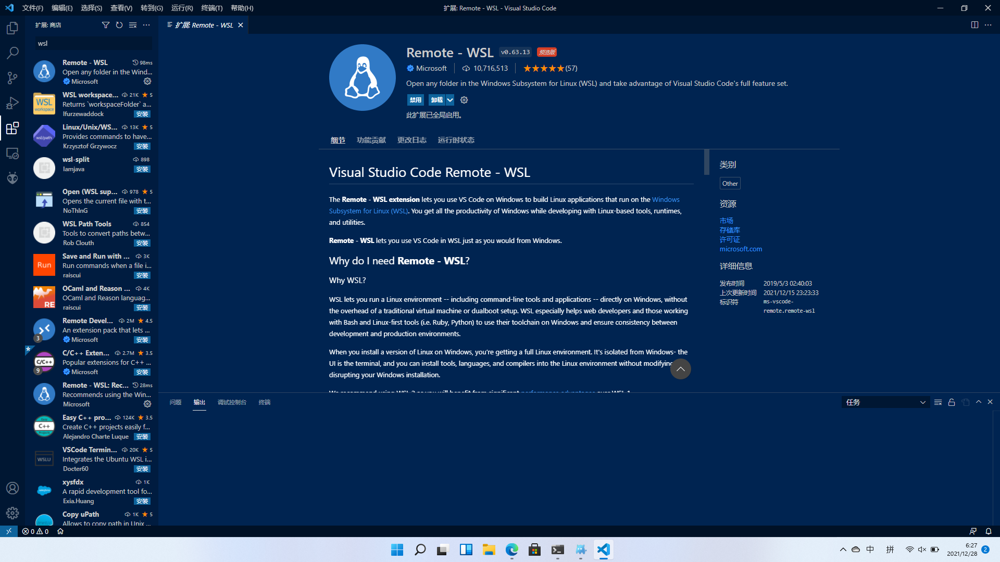
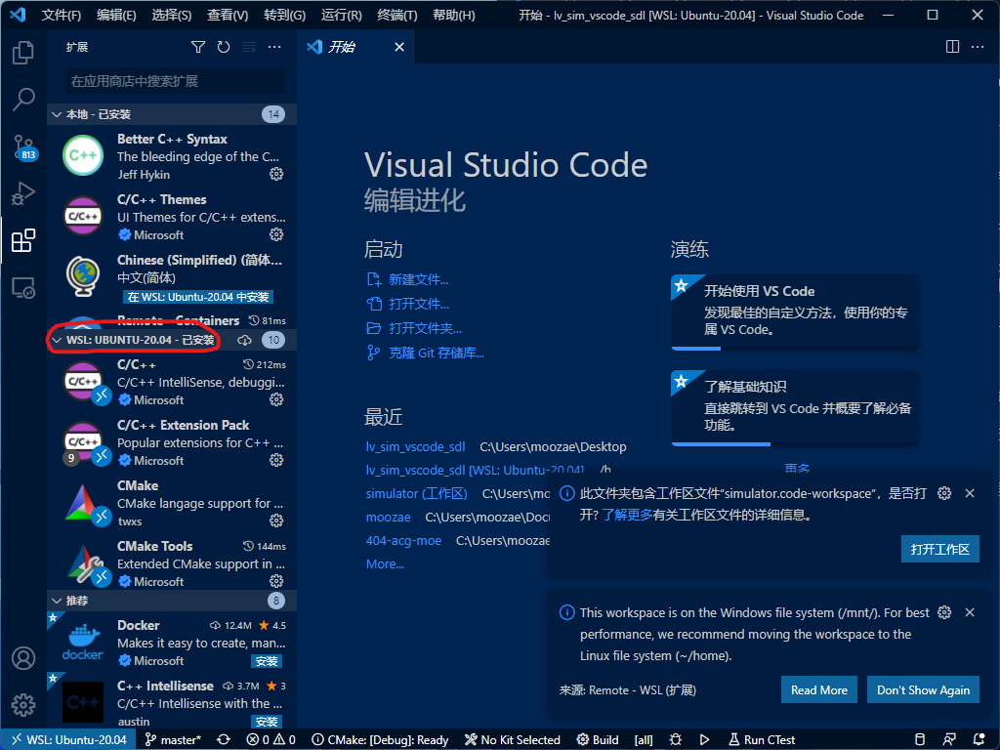
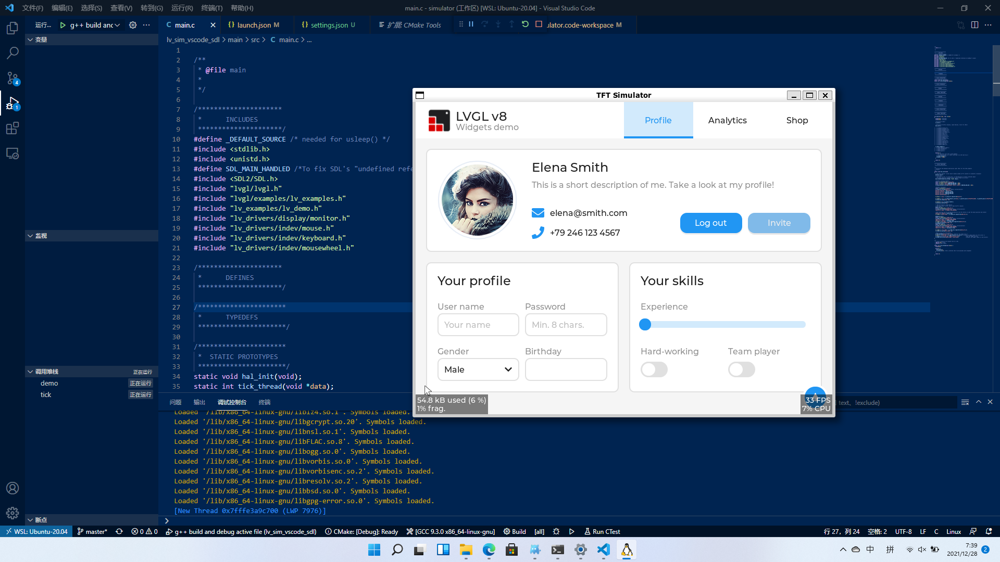

> 前排提示：本文含有大量的废话，可以选择跳过从“说干咱们就干”小节开始看起

## 背景

最近在搞点小玩意，需要搞个嵌入式UI，本来计划掏出用的N久的qt for nuc来着，但是刷b站的时候偶然间发现了LVGL这个玩意 ~~（b站害我）~~ ，就想着要不找个新项目就用LVGL来写吧

## 发生了啥？

LVGL很贴心的提供了模拟器，免去了交叉编译下载到硬件的步骤，这样我就可以很方便的来设计UI，但是……

由于我在学校没法用自己的电脑，并且学校的电脑只有Windows……

虽然LVGL提供了windows的模拟器，然而只给了codeblocks和visual studio的环境，我却是个vscode无脑党……

## 然后呢？

然后我就开始在网上搜有没有解决方案，最终在搜遍了整个google没有找到可行的解决方案，在gitee找到了一个三方的项目（https://gitee.com/t01051/lvgl-windows-sim-vscode）可以运行但是有些小问题……

于是我差点放弃了vscode转去安装vs……

直到我打开了vs的安装界面。。。

王德发？？？居然要4G，杀了我吧！

那就试试codeblocks？

~~算了oi时期的噩梦~~

## 是不是玩不起？

好吧我承认我确实有点放弃

`但是` windows不是号称 ~~最棒的linux发行版~~ 吗？

对了，wsl！

~~然后我兴冲冲的安装了x11 server~~

等等！好像麻烦了！

wsl2有[wslg](https://github.com/microsoft/wslg)啊！

## 说干咱们就干！

安装vscode和wsl的废话这里不再赘述

至于wslg，可以参考[官方文档](https://github.com/microsoft/wslg)

这里建议先安装下Gedit测试下，顺便利用apt安装Gedit的过程补全各种依赖



然后咱们开工！

由于我这里使用的是ubuntu2004环境，所以我用此环境做为演示，其他系统环境大同小异

参考[lv_sim_vscode_sdl](https://github.com/lvgl/lv_sim_vscode_sdl)的官方文档，先把依赖补全
```bash
sudo apt-get update && sudo apt-get install -y build-essential libsdl2-dev
```
注意wsl的ubuntu默认不带gcc和make，所以你需要apt安装一下

打开vscode，安装Remote-WSL插件


将lv_sim_vscode_sdl克隆到你想要的地方，注意该项目引用了子模块，不要忘记克隆子模块，不然模拟器将无法运行

```bash
git clone --recursive https://github.com/lvgl/lv_sim_vscode_sdl
```
用vsc打开文件夹，点击vsc左下角的蓝色按钮，在上方弹出的选项框中选择 `Reopen Folder in WSL…` 

根据右下角提示在wsl里安装'C/C++' 'C/C++ Extension Pack' 'CMake' 'CMake Tools'四个拓展



打开文件夹包含的工作区

打开 `main/src/main.c`

点击F5试试效果吧，不出意外就可以工作了~
